# 00 — Source of Truth

**Sistema:** BancoCloud Multicloud Fraud Platform  
**Tipo:** proyecto académico / demostrador, no banco real  
**Arquitectura:** AWS + on-premise simulado + Azure  
**Caso conductor:** monitoreo de fraude transaccional casi en tiempo real  
**Estado:** baseline arquitectónico v1.0

---

## 1. Propósito y alcance

BancoCloud demuestra una arquitectura bancaria híbrida multicloud en la que el canal digital, el core y la plataforma de inteligencia están deliberadamente separados.

El sistema debe demostrar de forma coherente:

1. banca digital web y/o móvil;
2. autenticación del cliente;
3. cuentas, tarjetas, préstamos y transacciones;
4. persistencia transaccional ACID;
5. Transactional Outbox;
6. publicación de eventos a Azure;
7. scoring antifraude mediante reglas + ML;
8. clasificación de riesgo LOW/MEDIUM/HIGH;
9. creación de casos para HIGH;
10. Data Lake Bronze/Silver/Gold;
11. BI para fraude, morosidad y rentabilidad;
12. apoyo GenAI al analista, fuera de la decisión financiera;
13. seguridad, observabilidad, auditoría y CI/CD;
14. diferenciación explícita entre prototipo Student y arquitectura bancaria objetivo.

### 1.1 No objetivos

El prototipo **no** pretende:

- operar dinero real;
- usar PII/PAN/CVV/credenciales reales;
- reemplazar el core bancario de una entidad real;
- ejecutar bloqueo automático basado en ML;
- afirmar cumplimiento/certificación PCI DSS, SBS o protección de datos;
- construir un sistema AML completo;
- desplegar una topología productiva multirregión usando créditos académicos.

---

## 2. Principio arquitectónico rector

> **AWS entrega la experiencia digital; el core on-premise conserva la verdad transaccional; Azure observa, enriquece, puntúa, alerta, aprende y analiza.**

Una caída de Azure no debe impedir que el core registre una operación válida. Para ello el core registra `Transaction + OutboxEvent` en la misma transacción y publica cuando exista conectividad.

El fraude se divide en dos capas:

- **Inline crítico, on-premise:** reglas determinísticas que sí pueden condicionar la operación por razones explícitas.
- **Near-real-time, Azure:** análisis de contexto, reglas avanzadas y ML; en el MVP observa, clasifica y crea alertas/casos, pero no se convierte en autorizador.

---

## 3. Arquitectura lógica canónica

```mermaid
flowchart LR
  subgraph AWS["AWS · Digital Banking Experience Layer"]
    CH[Web / Mobile / otros canales]
    WAF[AWS WAF]
    APIGW[Amazon API Gateway]
    COG[Amazon Cognito]
    BFF[Backend Digital\nLambda · MVP]
    EXP[Operaciones digitales / reclamos / notificaciones]
    CH --> WAF --> APIGW --> COG --> BFF --> EXP
  end

  subgraph CORE["ON-PREMISE · Core Bancario"]
    CAPI[Core Banking API]
    INLINE[Reglas críticas antifraude inline]
    OLTP[(PostgreSQL OLTP\nSistema autoritativo)]
    OUT[Transactional Outbox]
    PUB[Outbox Publisher]
    PSEUDO[Minimización + pseudonimización]
    CAPI --> INLINE --> OLTP
    OLTP --> OUT --> PUB --> PSEUDO
  end

  subgraph AZ["MICROSOFT AZURE · Banking Intelligence Platform"]
    EH[Azure Event Hubs]
    PROC[Fraud Stream Processor\nfeatures + enrichment]
    SCORE[Fraud Scoring Engine\nrules + ML + policy]
    LOW[LOW · log]
    MED[MEDIUM · monitoreo]
    HIGH[HIGH · crear caso]
    SB[Azure Service Bus]
    CASE[Fraud Case Service]
    CASEDB[(Azure SQL\nfraud cases + profile snapshots)]
    PORTAL[Portal de Analistas]
    AOAI[Azure OpenAI\nresumen controlado]
    ADLS[ADLS Gen2\nBronze / Silver / Gold]
    SYN[Synapse Serverless]
    PBI[Power BI]

    EH --> PROC --> SCORE
    SCORE --> LOW
    SCORE --> MED
    SCORE --> HIGH --> SB --> CASE --> CASEDB
    CASEDB --> PORTAL
    CASEDB --> AOAI --> PORTAL
    EH --> ADLS --> SYN --> PBI
  end

  BFF --> CAPI
  PSEUDO --> EH
```



### 3.1 Conectividad

**TARGET bancario:** ExpressRoute como conectividad privada principal, resiliencia según BIA, VPN S2S como mecanismo complementario cuando corresponda, Private Endpoints para PaaS y segmentación hub-spoke.

**STUDENT:** conectividad por Internet/TLS controlada y datos sintéticos. No se simula una WAN bancaria costosa solo para “parecer producción”.

---

## 4. Matriz canónica de componentes

| Dominio | Componente lógico | MVP académico | Target bancario | Regla |
|---|---|---|---|---|
| Canal | Web | S3 + CloudFront | CloudFront/edge corporativo | Contenido estático separado del backend |
| Perímetro AWS | WAF | Activar en demo full si presupuesto | Obligatorio según threat model | No es requisito para desarrollar local |
| API digital | Gateway | API Gateway HTTP API | API Gateway/arquitectura corporativa | Rate limit, auth y contracts |
| Identidad cliente | Customer IAM | Cognito | IAM/Cognito/IdP definido por banco | No confundir con Entra de analistas |
| Backend digital | BFF | Lambda | Lambda o ECS/Fargate según carga | **Lambda es la implementación base** |
| Core | Core API | FastAPI/Java + Docker local | Core real | Azure no es sistema de registro |
| OLTP | Base autoritativa | PostgreSQL local | DB core real | ACID e integridad |
| Fraude inline | Reglas críticas | Módulo core | Motor/servicio de políticas core | Determinístico |
| Integración | Outbox | PostgreSQL outbox | Outbox/CDC enterprise | At-least-once + idempotencia |
| Stream | Broker | Event Hubs Standard | Event Hubs tier según requisitos | Eventos, no comandos |
| Hot path | Stream processor | Módulo `fraud-engine` en Container Apps | Servicio independiente/stateful streaming si escala | Separación lógica, co-deploy físico permitido |
| Scoring | Rules+ML | Módulo `fraud-engine` en Container Apps | Servicio independiente | GenAI nunca decide score |
| Profile store | Perfil online | **Azure SQL, mismo DB con schema separado** | Cosmos/Redis/SQL según benchmark | No añadir servicio por moda |
| Casos | Queue | Service Bus | Service Bus | Solo HIGH crea caso por defecto |
| Casos | Case service | Container App | Servicio HA | Idempotente |
| Casos | DB | Azure SQL | SQL/managed DB HA | Puede compartir DB con profiles en Student |
| Lake | Raw/curated | ADLS Gen2 | ADLS Gen2 | Bronze/Silver/Gold |
| Analytics | Query | Synapse Serverless bajo demanda | Plataforma DW según volumen | No Dedicated Pool en Student |
| BI | Dashboard | Power BI Desktop | Power BI Service/capacity | Gold, nunca Bronze directo |
| GenAI | Case summary | Azure OpenAI si hay cuota; fallback demo explícito | Azure OpenAI/modelo aprobado | Fuera del critical path |
| Staff IAM | Analistas/admin | Entra ID/RBAC donde aplique | Entra + PIM/CA según licencias | Separado de Cognito |
| Secrets | Key Vault | Key Vault + Managed Identity | HSM/Key Vault según policy | Evitar secretos largos |
| Registry | Imágenes | ACR Basic | ACR/registry corporativo | Imágenes versionadas y escaneadas |
| Hybrid management | Azure Arc | Opcional | Azure Arc si aporta gobierno híbrido | Management plane; nunca data path |
| CI/CD | Pipeline | GitHub Actions | GitHub Actions/enterprise pipeline | OIDC hacia cloud cuando sea viable |
| IaC Azure | Infra | Bicep | Bicep | Provider-native |
| IaC AWS | Infra | SAM/CloudFormation | SAM/CDK/CloudFormation | Provider-native |

### 4.1 Decisión de optimización

Para Student, `Fraud Stream Processor` y `Fraud Scoring Engine` son **componentes lógicos separados pero pueden vivir dentro de un único Container App**. La separación física solo ocurre cuando una prueba de carga, seguridad, ownership o escalabilidad lo justifique.

Esto conserva la arquitectura de la imagen sin pagar por microservicios innecesarios.

---

## 5. Flujo transaccional end-to-end

1. Cliente usa web/móvil.
2. CloudFront/WAF protege el canal web cuando esté habilitado.
3. API Gateway valida políticas de entrada.
4. Cognito autentica al cliente.
5. Lambda BFF traduce la intención digital a un contrato del core.
6. Core valida cuenta, saldo, estado y reglas críticas inline.
7. PostgreSQL confirma `Transaction` y `OutboxEvent` en la misma transacción.
8. Outbox Publisher toma el evento pendiente.
9. Integration Zone minimiza y pseudonimiza.
10. `TransactionPosted.v1` se publica en Event Hubs.
11. Fraud Engine enriquece y calcula features.
12. Rules + ML producen `score`, `reason_codes`, versiones y evidencia.
13. Policy Engine clasifica:
    - LOW → log y telemetría.
    - MEDIUM → monitoreo/alerta, sin crear caso por defecto.
    - HIGH → `CreateFraudCase.v1` a Service Bus.
14. Case Service crea el caso idempotentemente.
15. Azure OpenAI puede producir un resumen basado solo en evidencia estructurada.
16. Analista revisa y marca `CONFIRMED_FRAUD`, `LEGITIMATE` o `INCONCLUSIVE`.
17. La decisión se incorpora posteriormente al dataset etiquetado.
18. El cold path conserva eventos y decisiones para BI, auditoría y entrenamiento.

---

## 6. Contrato de eventos y semántica

El evento de producción representa **hechos**, no predicciones.

`TransactionPosted.v1` contiene identificadores técnicos pseudonimizados, monto, moneda, canal, dispositivo/beneficiario cuando aplica, ubicación general, método de autenticación, estado y correlation ID.

No contiene:

- `fraud_label`;
- `risk_score`;
- `alerta_sistema`;
- `fraud_scenario`;
- PAN, CVV, PIN, contraseña o biometría cruda;
- nombre/DNI/dirección real.

### 6.1 Pseudonimización

Para un entorno real, no se recomienda depender de un SHA-256 simple sobre IDs predecibles. El diseño utiliza **referencias pseudónimas estables derivadas con HMAC-SHA-256 o tokenización equivalente**, con material criptográfico administrado fuera del código.

En datos 100 % sintéticos pueden usarse UUIDs no reales.

---

## 7. Transactional Outbox e idempotencia

```text
BEGIN
  INSERT transaction
  INSERT outbox_event
COMMIT
```

El publicador marca el outbox como publicado únicamente después de recibir confirmación del broker. Los reintentos implican semántica at-least-once; por ello:

- cada evento tiene `event_id` único;
- consumidores registran/ignoran duplicados;
- creación de caso utiliza una clave idempotente (`transaction_ref + policy_version` o equivalente);
- el `correlation_id` viaja de punta a punta.

---

## 8. Fraude: reglas, ML y policy engine

La decisión NRT combina:

```text
Raw event
   ↓
Enrichment + features
   ├───────────────┐
   ↓               ↓
Rules Engine     ML Model
   └───────┬───────┘
           ↓
      Policy Engine
      LOW/MEDIUM/HIGH
```

### 8.1 Features iniciales

- `tx_count_1m`, `tx_count_5m`, `tx_count_1h`;
- `amount_sum_5m`;
- `amount_vs_avg_30d`, `amount_vs_median_30d`;
- `new_device`, `device_age_days`;
- `new_beneficiary`;
- `usual_channel` / cambio de canal;
- `hour_deviation`;
- fallas de autenticación recientes;
- relación previa con beneficiario.

En el modo LOCAL FIRST, las ventanas y relaciones se derivan exclusivamente de
`TransactionPosted.v1` y del historial **anterior** del mismo cliente. Una primera
aparición observada de dispositivo o beneficiario no demuestra su fecha de alta real;
si no hay antecedentes suficientes, la feature queda desconocida. Fallas de
autenticación recientes requieren otra fuente gobernada y permanecen pendientes.
Las nuevas features descriptivas no alteran por sí mismas los pesos de la policy
versionada; véase ADR-0003 para el tratamiento de historial incompleto.

### 8.2 Política

Los thresholds son configuración versionada, no constantes escondidas en código. La elección debe considerar pérdida de fraude, costo de investigación, capacidad de analistas y fricción al cliente.

### 8.3 ML

- Baseline interpretable primero.
- Split temporal, no random-only.
- Métricas: PR-AUC, recall, precision, FPR, calibración, latencia y estabilidad temporal.
- Accuracy aislada no es criterio de éxito.
- Cada predicción registra `model_version`, `feature_version`, `policy_version` y `reason_codes`.

---

## 9. GenAI

GenAI se ejecuta **después** de que existe un caso y fuera del camino crítico.

Puede:

- resumir señales;
- organizar evidencia;
- identificar información faltante;
- ayudar a redactar una explicación para el analista.

No puede:

- cambiar el score;
- inventar evidencia;
- determinar culpabilidad;
- aprobar/rechazar transacciones;
- bloquear cuentas;
- reemplazar la decisión humana.

Toda salida GenAI debe conservar `prompt_version`, modelo, timestamp y referencia del input.

---

## 10. Datos: fuente original y dataset sintético

El dataset recibido se usa como **semilla de perfiles**, no como dataset transaccional final.

Motivos principales:

- no posee IDs transaccionales/cliente/cuenta suficientes;
- no representa secuencias temporales reales;
- su timestamp no permite ventanas de streaming confiables;
- contiene campos potencialmente derivados (`score_riesgo`, `alerta_sistema`);
- muestra señales de datos sintéticos/inconsistentes.

### 10.1 Proceso canónico

```text
Dataset original
      ↓
Data audit
      ↓
customer_seed limpio
      ↓
Synthetic Banking Generator
      ↓
customers/accounts/cards/loans/devices/beneficiaries
      ↓
transactions
      ├──────────────→ transaction_events
      └──────────────→ fraud_labels (separado)
```

### 10.2 Ground truth

`fraud_labels` se mantiene separado del evento operativo:

- `transaction_id`;
- `is_fraud`;
- `fraud_scenario`;
- `label_timestamp`;
- `label_source`.

El motor de scoring nunca recibe `fraud_scenario` ni la etiqueta como feature.

---

## 11. Hot path y cold path

### 11.1 Hot path

```text
Core → Outbox → Event Hubs → Fraud Engine → Policy → Service Bus → Case
```

Objetivo: segundos y trazabilidad de punta a punta.

### 11.2 Cold path

```text
Event Hubs → ADLS Bronze → Silver → Gold → Synapse → Power BI / ML
```

Bronze conserva eventos inmutables; Silver limpia/deduplica/normaliza; Gold publica datasets de negocio y modelado.

El hot path **no espera** Bronze→Silver→Gold para puntuar.

---

## 12. Persistencia Bronze en Student

Para evitar una contradicción entre costo y arquitectura:

- **DEMO FULL:** Event Hubs Capture puede habilitarse durante ventanas controladas para aterrizar Bronze.
- **MVP LITE:** puede utilizarse un `bronze-writer` consumidor liviano o una exportación controlada de eventos.
- **TARGET:** la persistencia raw debe ser durable, gobernada y dimensionada según volumen/retención.

La elección física no cambia el contrato del evento.

---

## 13. Seguridad e identidad

### 13.1 Dos dominios de identidad

- **Clientes digitales:** Amazon Cognito.
- **Analistas/operadores cloud:** Microsoft Entra ID en Azure y roles equivalentes en AWS.

No se reutiliza Cognito como IAM administrativo ni Entra como sustituto improvisado del customer IAM.

### 13.2 Secretos

- preferir Managed Identity/OIDC sobre secretos permanentes;
- Key Vault para secretos inevitables;
- no guardar credenciales cloud reales en `.env` de repositorio;
- `.env.example` solo contiene nombres/placeholder;
- secretos de GitHub prohibidos cuando una federación de identidad los pueda sustituir.

### 13.3 Azure Arc

Azure Arc es opcional para proyectar el servidor on-premise simulado al plano de gestión Azure y demostrar inventario/política/monitorización híbrida. **La transacción nunca pasa por Arc**; no forma parte del data plane.

### 13.4 Logs

No registrar payloads completos. Logs operativos usan IDs técnicos/pseudónimos, correlation ID, latencia, status, versión del modelo y nivel de riesgo.

---

## 14. Observabilidad

La observabilidad debe cubrir cuatro planos:

| Plano | Métricas |
|---|---|
| Plataforma | disponibilidad, errores, CPU/memoria, dependencias |
| Streaming | throughput, lag, reintentos, eventos tardíos |
| Modelo | score distribution, latencia, drift, versión |
| Negocio | alert rate, confirmed fraud, false positives, analyst workload |

`correlation_id` une AWS → core → outbox → Event Hubs → fraud engine → case.

---

## 15. SLO de ingeniería del prototipo

Son objetivos de prueba, no SLA bancarios contractuales.

| Métrica | Objetivo inicial |
|---|---:|
| API demo | ≥ 99.9 % durante ventana de demostración |
| Event ingestion p95 | < 500 ms |
| Fraud processing p95 | < 2 s |
| Creación de caso HIGH p95 | < 5 s |
| Duplicación de casos | 0 |
| Eventos inválidos promovidos | 0 |
| Predicciones con versiones/model metadata | 100 % |
| Trazabilidad con correlation ID | 100 % |

Se ajustan después de medir, no se presentan como promesa contractual.

---

## 16. Arquitectura Student: modo mínimo defendible

### AWS

- S3 + CloudFront para web.
- API Gateway HTTP API.
- Cognito.
- **Una Lambda BFF** como backend digital inicial.
- WAF activado solo cuando se necesite demostrar el control o si el presupuesto lo permite.

### On-prem simulado

- Docker.
- Core API.
- PostgreSQL.
- reglas inline.
- outbox.
- publisher.

### Azure

- Event Hubs Standard.
- **Un Container App `fraud-engine`** con módulos de enrichment/scoring/policy.
- Azure SQL: schemas para `fraud_case` y `fraud_profile`.
- Service Bus.
- ADLS Gen2.
- Key Vault.
- ACR Basic para imágenes cuando se desplieguen contenedores.
- Azure Arc opcional para management plane.
- Monitor/App Insights con retención controlada.
- Power BI Desktop.
- Synapse Serverless/Azure OpenAI solo bajo demanda.

No se despliegan de inicio: AKS, Managed Redis, Cosmos DB, Dedicated SQL Pool, ExpressRoute, VPN Gateway, Azure Firewall Premium, multi-region, Purview permanente ni APIM Premium.

---

## 17. Arquitectura TARGET bancaria

La vista objetivo incorpora, sujeto a BIA/compliance/benchmark:

- ExpressRoute resiliente y segmentación privada;
- Private Endpoints/Private DNS;
- redundancia zonal/regional donde corresponda;
- perfiles online en store especializado si el benchmark lo exige;
- escalado independiente de stream processing y scoring;
- WAF y controles de edge empresariales;
- SIEM/SOC y gobierno/lineage empresarial;
- PIM/Conditional Access/licencias corporativas;
- DR probado y RPO/RTO derivados de BIA;
- políticas CMK/HSM cuando sean exigibles.

TARGET no significa “todo servicio premium posible”; significa controles justificados por riesgo, volumen y regulación. La documentación puede mapear controles a PCI DSS, SBS y protección de datos peruana como referencias de diseño, pero el prototipo no declara certificación ni cumplimiento legal formal.

---

## 18. Repositorio canónico

```text
bancocloud-multicloud-fraud-platform/
├── README.md
├── AGENTS.md
├── .github/
│   └── copilot-instructions.md
├── docs/
│   ├── 00_SOURCE_OF_TRUTH.md
│   ├── 01_REVIEW_AND_RESOLUTIONS.md
│   ├── 02_IMPLEMENTATION_MODES_COST.md
│   ├── 03_EXECUTION_ROADMAP.md
│   ├── 04_SECURITY_DATA_GOVERNANCE.md
│   ├── 05_TEST_STRATEGY.md
│   ├── adr/
│   └── diagrams/
├── specs/
│   └── 000-platform/
│       ├── spec.md
│       ├── plan.md
│       └── tasks.md
├── contracts/
│   ├── transaction.v1.schema.json
│   ├── fraud-score.v1.schema.json
│   ├── create-fraud-case.v1.schema.json
│   └── analyst-decision.v1.schema.json
├── data/
│   ├── seed/
│   ├── generator/
│   ├── synthetic/
│   └── quality/
├── src/
│   ├── aws-digital/
│   ├── core-simulator/
│   ├── outbox-publisher/
│   ├── fraud-engine/
│   ├── fraud-case-service/
│   └── analyst-portal/
├── infra/
│   ├── aws/sam/
│   └── azure/bicep/
└── tests/
```

---

## 19. Control de cambios

Una modificación a plataforma, ownership, ubicación cloud, contrato de evento, política de riesgo o boundary de seguridad requiere:

1. ADR nuevo o actualizado;
2. actualización de esta fuente de verdad en el mismo PR;
3. actualización de spec/plan/tasks afectados;
4. pruebas/contratos actualizados;
5. evidencia de que no rompe AWS↔core↔Azure.

Los agentes **no** pueden agregar servicios porque “serían útiles” sin justificar costo, responsabilidad, datos y necesidad.

---

## 20. Definition of Done arquitectónico

Una feature está terminada cuando:

- cumple su spec;
- respeta este documento;
- pasa contratos y pruebas;
- no introduce PII real;
- no rompe idempotencia/trazabilidad;
- tiene telemetría mínima;
- tiene coste/lifecycle definido si crea recursos;
- documenta fallback/degradación;
- deja evidencia reproducible;
- actualiza documentación solo donde corresponda, sin duplicar requisitos.
